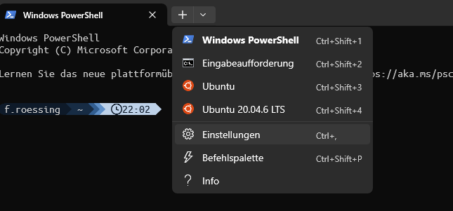

I recently discovered the new windows terminal, which has great features for using multiple different shells. 
I can use powersehll, cmd and my wsl systems from there with ease. 
But as always, me as a nerd wants it stylish and colorful.
So I decided to also try my hands on [starship](starship.rs), which is a universal tool to make nicer looking terminal prompts in the style of powerlines.
How i use starship for different terminals you can find discussed below.
Up here I want to start discussing how I can make the layout.
## A Font
The first and most important thing is, you will need to select a font. 
Not any kind of font, you need a [Nerd Font](nerdfonts.com), because nerdfonts support glyphs. Everything from Powerline to Font Awesome and what ever you can think of.
You will need to select a nerd font and download it. I know its a hard choice.
I went for UbuntuMono for now. Download the zip file and open it. Inside there will be a lot of .ttf files, install them.

Now you can open windows terminal and open its settings:

Inside the settings you can either sett the appearence for every shell speratly or set the defaults to your installed nerd font.

Now to the part that actually has to do with starship.
I need a starship configuration. Starship uses [[toml]] files for configuration.
My toml file is saved as `~/.config/starship.toml`.

## A color palette
To write my toml file, I first picked a color pallete.
Next up I decided, I will need a color palette to make my shell look nice.
I decided for a blue color pallete for now:

(To define nice collor palettes, you can use: [w3school](https://www.w3schools.com/colors/colors_monochromatic.asp))

To set collors in the starship.toml i had to define a new member of palettes, at the bottom of my starship.toml, as so:
```toml
[palettes.MyBlues]
color_blue_0 = "#0E1A29"
color_blue_1 = "#172C44"
color_blue_2 = "#325E91"
color_blue_3 = "#5F90C8"
color_blue_4 = "#BED2E9"
```
I tried using names Blue0 through Blue4, but that did not work out from some reason, maybe the names must be in lowercase.
At the top of starship.toml file I set : `palette = "MyBlues"`

## Styling a prompt
(Or, the hipster version of propt engineering)
What do you want to have in your prompt?
I decided, I wanted:
- username - so i know as who i am locked in
- hostname - so i know where i am logged in
- path - so i know where i am
- git branch and status
- some of my most common laguages
- current time 

so my prompt format in starship.toml now looks like this:
```toml
palette = "MyBlues"
format = """
[](color_blue_0)\
$os\
$username\
[](bg:color_blue_1 fg:color_blue_0)\
$directory\
[](fg:color_blue_1 bg:color_blue_2)\
$git_branch\
$git_status\
[](fg:color_blue_2 bg:color_blue_3)\
$python\
$nodejs\
$docker_context\
[](fg:color_blue_3 bg:color_blue_4)\
$time\
[ ](fg:color_blue_4)\
"""
```

Below that you can customize the individual fields like this:
```toml 
[git_branch]
symbol = ""
style = "bg:color_blue_2"
format = '[ $symbol $branch ]($style)'
```

## Deploying to different terminals
### Powershell
The powershell config file can be found under the environment variable $PROFILE. I put the following into the file: 
```
Invoke-Expression (&starship init powershell)
$ENV:STARSHIP_CONFIG = "$HOME\.config\starship.toml"
```
The first line gets powershell to use starship. 
The second point starship to my config file.
### CMD
Not implemented.
### Ubuntu (WSL)
I had some issues here with a snapd problem. I had to install snapd first.
Then I could install a version of starship with `sudo snap install starship`.
Then I added 
```
eval "$(starship init bash)"
export STARSHIP_CONFIG=/mnt/c/users/f.roessing/.config/starship.toml
```
To my `~/.bash_aliases`.

Remember to also set the correct font in the settings of windows terminal.
As you might have seen I can use the same version of `starship.toml` for all shells I use on my machine.

### ZSH
Not implemented.